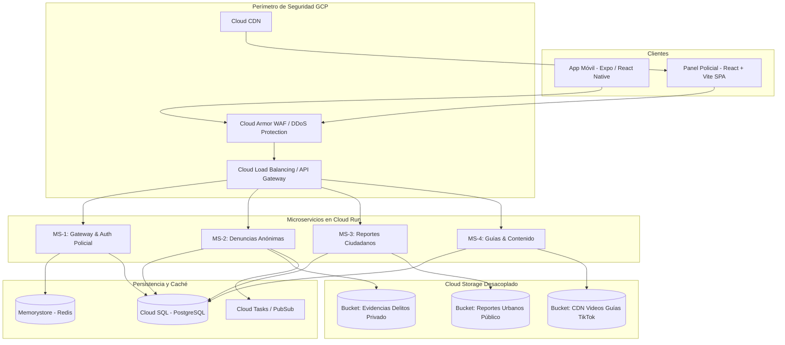

# Arquitectura de Microservicios en Google Cloud Platform (GCP)

Arquitectura desacoplada, orientada a alta resiliencia y aislamiento de fallos ante ataques o sobrecargas operativas.

---

## 1. Diagrama de Topología General

---

## 2. Descomposición de los 4 Microservicios (FastAPI)

Cada microservicio se empaqueta en un contenedor Docker ligero optimizado (Python 3.12-slim + FastAPI + Uvicorn) y corre en **Cloud Run** con escalado a cero (Scale-to-Zero) e instancias bajo demanda.

### 🛡️ MS-1: Gateway & Auth Policial
- **Misión:** Gestión de seguridad perimetral, tokens JWT, RBAC de oficiales policiales y limitador de tasa (Rate Limiting).
- **Dependencias:** Memorystore (Redis) para blacklist de tokens y rate limiting por IP/subnet; Cloud SQL (tabla `officers`).
- **Resiliencia:** Si este servicio experimenta alta carga administrativa, las denuncias anónimas y reportes cívicos continúan funcionando sin interrupción.

### 🚨 MS-2: Denuncias Anónimas
- **Misión:** Recepción e ingesta segura y anónima de denuncias de delitos (robo, violencia, extorsión, etc.).
- **Dominio de Datos:** Tablas `reports` (tipo `denuncia_anonima`), `report_status_history`, `report_media`.
- **Manejo de Multimedia:**
  - Bucket privado aislado: `gs://comisaria-evidencias-delitos/`
  - Sanitización estricta: eliminación de metadatos EXIF / geolocalización embebida en memoria antes de guardar.
  - Acceso mediante **URLs firmadas temporales (V4 Signed URLs)** con expiración máxima de 15 minutos solo para oficiales autenticados.
- **Asincronía:** Encola procesamiento pesado de video/audio mediante **Cloud Tasks**.

### 🏘️ MS-3: Reportes Comunitarios / Ciudadanos
- **Misión:** Registro de problemas urbanos no criminales (baches, alumbrado, basura, desagües) y generación de tarjetas sociales.
- **Dominio de Datos:** Tablas `reports` (tipo `reporte_comunitario`), `report_share_events`.
- **Manejo de Multimedia:**
  - Bucket optimizado para difusión: `gs://comisaria-reportes-urbanos/`
  - Generación / almacenamiento de tarjetas visuales cívicas sin PII para compartir en WhatsApp y redes.

### 📱 MS-4: Guías y Contenido (Biblioteca TikTok)
- **Misión:** Servir el feed vertical de microvideos de prevención, pasos explicativos y analíticas anónimas de visualización.
- **Dominio de Datos:** Tablas `guide_categories`, `guides`, `guide_resources`, `guide_analytics_daily`.
- **Manejo de Multimedia:**
  - Bucket público vía CDN: `gs://comisaria-guias-videos/`
  - Integración con **Cloud CDN** para distribución ultra-rápida y bajo retardo de streaming de video vertical en formato H.264 / WebM.

---

## 3. Estrategia de Aislamiento de Fallos y Seguridad

1. **Aislamiento de Almacenamiento (Storage Isolation):**
   - Un ataque o saturación en la subida de videos de guías no afecta el bucket reservado de evidencias criminales.
   - Políticas IAM independientes por Service Account para cada contenedor de Cloud Run.
2. **Defensa contra Denegación de Servicio (DDoS / Brute Force):**
   - **Cloud Armor:** Reglas WAF para mitigar SQLi, XSS, geo-bloqueos si aplica y mitigación L7 DDoS.
   - **Memorystore Redis:** Token bucket rate limiter por IP en endpoints de denuncias y reportes para prevenir spam automatizado.
3. **Zero-Trust Interno:**
   - La base de datos Cloud SQL se accede vía **Cloud SQL Auth Proxy** o VPC Connector privado, sin IP pública abierta a internet.
