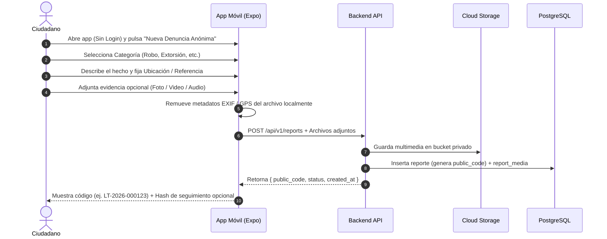

# Flujo de Denuncias Anónimas

Protocolo de extremo a extremo para la recepción, procesamiento y almacenamiento de denuncias sin comprometer la identidad del ciudadano.

---

## 1. Flujo del Ciudadano (Frontend)

### Pasos detallados:
1. **Acceso directo:** Pantalla de inicio con botón destacado *"Nueva Denuncia Anónima"*.
2. **Selección de categoría:** Íconos intuitivos y directos.
3. **Ubicación:** Mapa interactivo o campo de texto con referencias físicas.
4. **Evidencia:** Cámara o galería (compresión automática en el dispositivo).
5. **Generación de código:** Recibe código único `LT-YYYY-XXXXXX`.
6. **Código secreto opcional:** El usuario puede definir un PIN secreto; la base de datos sólo almacena el hash criptográfico.

---

## 2. Flujo del Backend (Servidor)

Al recibir una denuncia:

1. **Validación de integridad:** Validar tamaño de textos, tipos MIME y límites de tamaño.
2. **Generación de identificador:** Generar `public_code` secuencial/único distrital.
3. **Sanitización de archivos:** Eliminación en servidor de metadatos EXIF/IPTC residuales.
4. **Almacenamiento seguro:** Subida a bucket privado (Supabase Storage / AWS S3 / Cloud Storage).
5. **Persistencia en base de datos:**
   - Registro en tabla `reports`.
   - Registro de archivos en `report_media`.
   - Inserción de estado inicial en `report_status_history` (`pendiente`).
6. **Respuesta mínima:** Responder a la aplicación exclusivamente con:
   - `public_code`
   - `status`
   - `created_at`
   *(Nunca registrar ni retornar IPs ni identificadores de hardware).*
