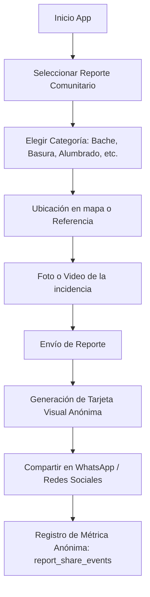

# Flujo de Reportes Comunitarios

Los reportes comunitarios atienden incidencias de infraestructura urbana, servicios públicos y espacios barriales no criminales, incorporando un componente de difusión cívica.

---

## 1. Flujo de Creación y Difusión



---

## 2. Tarjeta Visual para Redes Sociales

Al completar el reporte, la aplicación genera dinámicamente una imagen/tarjeta optimizada para historias y mensajes:

```text
┌──────────────────────────────────────────────┐
│  🏛️ REPORTE CIUDADANO - LA TINGUIÑA         │
├──────────────────────────────────────────────┤
│  Código:      LT-2026-000456                 │
│  Categoría:   💡 Alumbrado Público           │
│  Ubicación:   Frente a la losa deportiva     │
│  Estado:      🟡 Pendiente de atención       │
│  Fecha:       24/08/2026                     │
├──────────────────────────────────────────────┤
│  [ Foto de la incidencia ]                   │
├──────────────────────────────────────────────┤
│  App Oficial Comisaría La Tinguiña           │
└──────────────────────────────────────────────┘
```

> [!NOTE]
> La tarjeta no contiene ningún dato personal del emisor ni rastreador individual. Solo exhibe los datos públicos del incidente para promover la rápida atención de las autoridades municipales o policiales.
