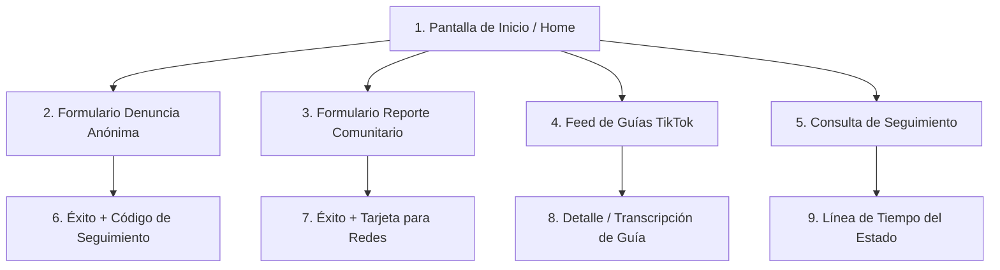

# Mapa de Pantallas y Experiencia de Usuario (Fase 1)

---

## 1. Pantallas de la Aplicación Ciudadana (Móvil)

### Detalle de Vistas:
1. **Inicio / Home:** Tres botones de alto contraste y gran formato:
   - *Denuncia Anónima* (Acción prioritaria de seguridad).
   - *Reporte Comunitario* (Problemas de vecindario e infraestructura).
   - *Guías Rápidas* (Videos y consejos preventivos).
2. **Formulario Denuncia Anónima:**
   - Selector de categorías con íconos.
   - Campo descriptivo del incidente.
   - Selector de ubicación (Geolocalización GPS o referencia manual).
   - Adjuntar evidencia (Cámara, galería, grabador de audio).
3. **Formulario Reporte Comunitario:**
   - Selección de tipo de falla urbana (baches, alumbrado, basura, etc.).
   - Foto y referencia de ubicación.
4. **Pantalla de Confirmación / Éxito:**
   - Visualización clara del código público generado (ej. `LT-2026-000123`).
   - Opción para copiar código o guardar captura/tarjeta.
   - Opción para ingresar clave secreta de seguimiento.
5. **Feed de Guías (TikTok Style):**
   - Reproductor vertical a pantalla completa con navegación por swipe.
   - Filtros de categorías en la cabecera.
6. **Buscador de Seguimiento:**
   - Formulario simple para ingresar código público + clave secreta.
   - Historial de estados con fechas y notas públicas de resolución.

---

## 2. Pantallas del Panel Policial (Web / Tablet)

1. **Login Policial:** Autenticación por correo y contraseña segura (con hash en backend).
2. **Dashboard / Resumen:** Métricas del día (reportes pendientes, atendidos, por sector y tipo).
3. **Bandeja de Entrada de Reportes:** Tabla con filtros avanzados (categoría, estado, fecha, prioridad).
4. **Detalle del Reporte:**
   - Datos del hecho y categorización.
   - Visualizador de multimedia protegido.
   - Ubicación en mapa interactivo.
   - Selector de cambio de estado con campo obligatorio de motivo/nota.
   - Cuadro de notas internas (solo visible para efectivos).
5. **Mapa Operativo:** Visualización de incidentes con marcadores clasificados por urgencia.
6. **Gestor de Guías:** Carga, edición y publicación de videos y contenido educativo.
