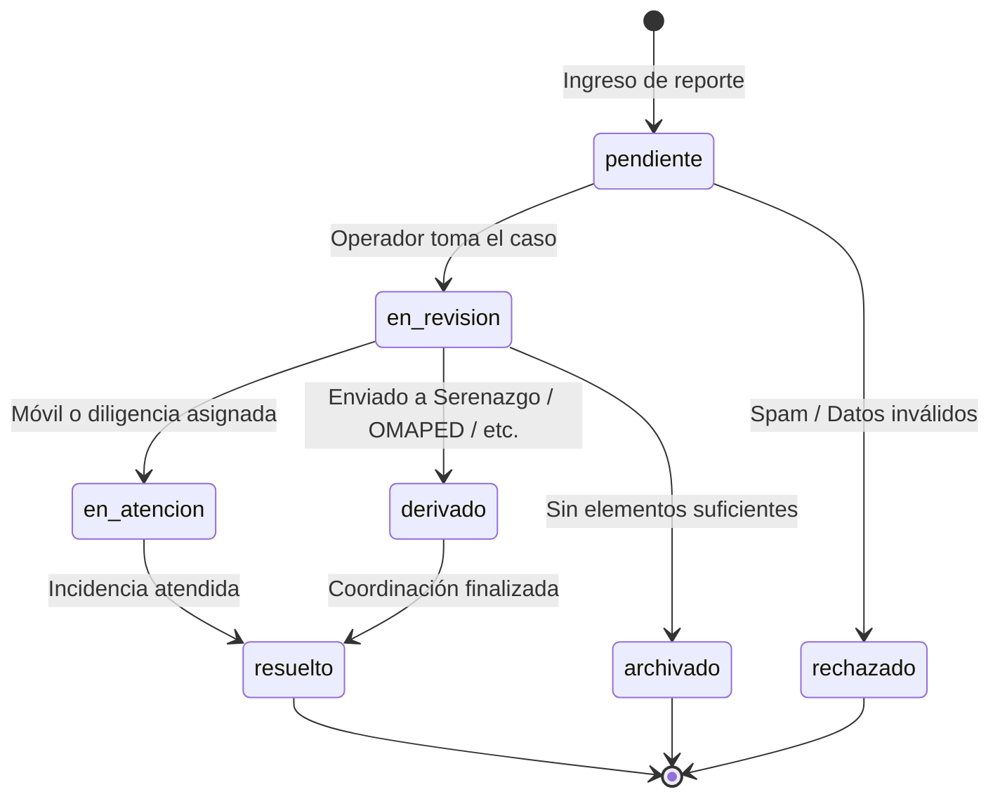

# Ciclo de Estados y Matriz de Prioridades

---

## 1. Ciclo de Vida de un Reporte (`report_status`)



### Detalle de Estados:

| Estado | Significado Operativo |
|---|---|
| `pendiente` | Recibido en sistema; en espera de triaje por operador de turno. |
| `en_revision` | Efectivo policial o moderador analizando los antecedentes y evidencia. |
| `en_atencion` | Intervención en curso o unidad policial desplazada al sector. |
| `derivado` | Transferido a otra entidad competente (ej. Serenazgo, Municipalidad, Fiscalización). |
| `resuelto` | Incidencia atendida y cerrada satisfactoriamente con constancia. |
| `archivado` | Caso cerrado sin resolución por falta de elementos o inviabilidad de seguimiento. |
| `rechazado` | Desestimado por tratarse de contenido no procedente, spam o falsedad manifiesta. |

---

## 2. Matriz de Prioridades (`report_priority`)

| Prioridad | Criterio de Aplicación | Protocolo |
|---|---|---|
| `urgente` | Peligro inminente a la vida, salud, secuestro o delito violento en flagrancia. | Alerta visual en panel + Protocolo de derivación a llamada 105. |
| `alta` | Delito consumado de impacto (robo agravado, agresión física, extorsión activa). | Asignación preferente en bandeja operativa. |
| `media` | Incidencia estándar, hurto simple o reporte comunitario relevante. | Atención en cola regular de patrullaje y despacho. |
| `baja` | Incidencia de baja lesividad, queja menor o sugerencia comunitaria. | Atención programada según disponibilidad. |

---

## 3. Protocolo de Emergencias (Derivación Telefónica 105)

> [!CAUTION]
> La aplicación **NO** sustituye la atención de emergencias en tiempo real (llamadas 105 / 911 / 106).

Si el usuario marca el switch de *"Emergencia"* o selecciona prioridad `urgente`, la aplicación interrumpe el flujo secundario y despliega una alerta modal inmediata:

```text
┌────────────────────────────────────────────────────────┐
│  ⚠️ ATENCIÓN: RIESGO INMEDIATO                         │
│                                                        │
│  Si estás en peligro en este momento o presencias una  │
│  emergencia en curso, comunícate de inmediato:         │
│                                                        │
│             [ 📞 LLAMAR AL 105 AHORA ]                 │
│                                                        │
│  La app procesa reportes por turnos y no garantiza     │
│  despacho inmediato de patrullas.                      │
│                                                        │
│  [ Continuar con reporte digital ]    [ Cancelar ]     │
└────────────────────────────────────────────────────────┘
```
