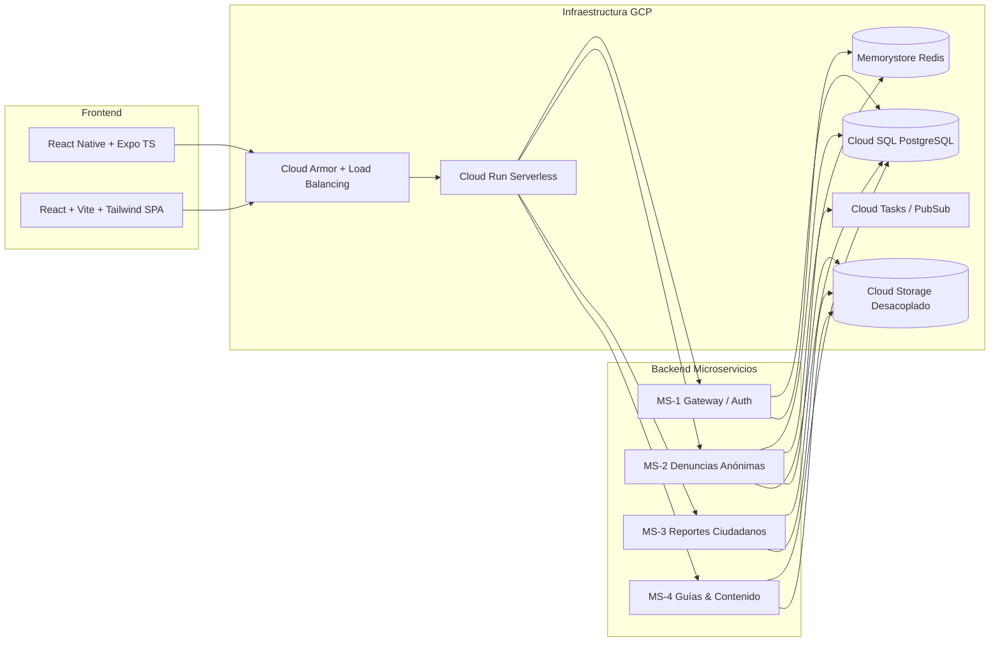

# Stack Tecnológico y Hoja de Ruta de Desarrollo

Especificación integral del stack acordado de inicio a fin (Mobile, Backend Microservicios, Cloud GCP y Web).

---

## 1. Stack Tecnológico Definitivo (End-to-End)

### 📱 Frontend Móvil (App Ciudadana)
- **Framework:** React Native con Expo (TypeScript, SDK 51+ / Latest).
- **Enrutamiento:** Expo Router o React Navigation (Stack + Bottom Tabs).
- **Gestión de Estado y Servidor:** TanStack Query (React Query) para caché, reintentos y mutaciones offline-first.
- **Formularios & Validación:** React Hook Form + Zod.
- **Multimedia:** `expo-camera`, `expo-image-picker`, `expo-av` (reproductor de video vertical para guías TikTok).
- **Geolocalización:** `expo-location` + `react-native-maps`.
- **Compartir:** `expo-sharing` + `react-native-view-shot` (render de tarjetas de reportes urbanos para WhatsApp/redes).

### 💻 Frontend Web (Panel Policial / Administrativo)
- **Framework:** React 18+ con Vite (TypeScript).
- **Estilos & UI:** Tailwind CSS + Componentes Shadcn UI / Radix Primitives.
- **Gestión de Estado:** Zustand + TanStack Query.
- **Mapas Operativos:** Leaflet / Mapbox GL para georreferenciación de incidentes.
- **Despliegue Web:** Firebase Hosting o Cloud Storage + Cloud CDN con compresión Brotli.

### ⚙️ Backend (Microservicios con FastAPI)
- **Lenguaje & Framework:** Python 3.12 + FastAPI + Uvicorn (ASGI).
- **Validación de Datos & DTOs:** Pydantic V2.
- **ORM / Conectores BD:** SQLAlchemy 2.0 (Asyncio) + `asyncpg` + Alembic para migraciones.
- **Sanitización de Multimedia:** `Pillow` / `piexif` (eliminación de metadatos EXIF) + `ffmpeg-python` (optimización y validación de codecs).
- **Seguridad & Criptografía:** `python-jose` (JWT), `passlib` / `argon2-cffi` (hash seguro de credenciales policiales y PINs de seguimiento).

### ☁️ Infraestructura & Servicios en Google Cloud Platform (GCP)
- **Cómputo:** **Google Cloud Run** (Contenedores serverless independientes por microservicio con Scale-to-Zero).
- **Seguridad Perimetral:** **Cloud Armor** (WAF, protección DDoS L7, limitación de tasa).
- **Base de Datos:** **Cloud SQL for PostgreSQL** (Instancia administrada con copias de seguridad automáticas y Cloud SQL Auth Proxy).
- **Caché & Rate Limiting:** **Cloud Memorystore for Redis** (Prevención de spam en reportes y sesiones).
- **Almacenamiento Desacoplado (Cloud Storage):**
  - Bucket 1 (Privado / Evidencias criminales con URLs firmadas): `gs://comisaria-evidencias-delitos/`
  - Bucket 2 (Público restringido / Tarjetas urbanas): `gs://comisaria-reportes-urbanos/`
  - Bucket 3 (Público CDN / Videos TikTok guías): `gs://comisaria-guias-videos/`
- **Tareas Asíncronas:** **Cloud Tasks** (Procesamiento en background de transcodificación y sanitización).

---

## 2. Hoja de Ruta de Construcción (Roadmap)

### 🔹 Sprint 1: Infraestructura Base, BD y MS-1 (Gateway / Auth)
1. Configuración de Terraform / scripts de despliegue en GCP (Cloud Run, Cloud SQL, Buckets y Redis).
2. Despliegue de esquema DDL en Cloud SQL (`schema.sql`).
3. Construcción del **MS-1 (Gateway & Auth)**: Login policial, generación/validación de JWT, middleware de rate limiting con Redis.
4. Setup del proyecto base en Expo (React Native) y Web SPA (React + Vite).

### 🔹 Sprint 2: MS-2 (Denuncias Anónimas) + App Móvil (Flujo Denuncias)
1. Construcción del **MS-2**: Endpoints de creación de denuncias, hash de código secreto, subida y sanitización de fotos/videos a bucket privado, generación de URLs firmadas.
2. Pantallas móviles: Formulario en 3 pasos, selector de categorías, geolocalización, captura de foto/video, confirmación con código `LT-YYYY-XXXXXX`.

### 🔹 Sprint 3: MS-3 (Reportes Comunitarios) y MS-4 (Guías TikTok)
1. Construcción del **MS-3**: Ingesta de reportes urbanos y generador de tarjetas sociales.
2. Construcción del **MS-4**: Endpoints de streaming de guías, registro de métricas ("me ayudó", vistas).
3. Pantallas móviles: Feed vertical continuo estilo TikTok con swipe y reproductor `expo-av`, tarjeta de difusión cívica.

### 🔹 Sprint 4: Panel Policial Web + Pruebas de Carga y Seguridad
1. Desarrollo de vistas de bandeja de reportes, mapa de incidentes y visor de evidencias en el Panel Web.
2. Pruebas de pentesting, validación de políticas Cloud Armor, verificación de eliminación de metadatos EXIF.
3. Despliegue a producción en GCP.
