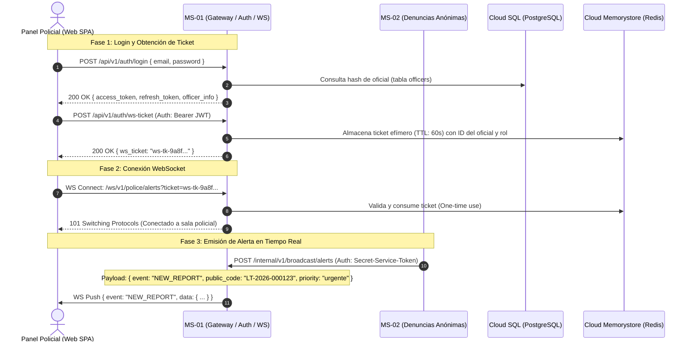

# Plan de Implementación: MS-01 Gateway, Auth Policial y WebSocket Hub (Versión Final)

**Microservicio:** `ms-01-gateway-auth`  
**Ubicación en repo:** `backEnd/services/ms-01-gateway-auth/`  
**Framework:** FastAPI (Python 3.12) + SQLAlchemy 2.0 Async + Pydantic V2  
**Despliegue objetivo:** Google Cloud Run (Serverless Container con `--timeout=3600`)

---

## 1. Responsabilidades del Microservicio

1. **Gestión de Identidad y RBAC:** Autenticación de efectivos policiales (`admin`, `comisario`, `operador`, `moderador`) con contraseñas seguras (Argon2id) y emisión de tokens JWT seguros (Access & Refresh tokens vía `PyJWT`).
2. **Hub de Notificaciones WebSocket en Tiempo Real:** Canal bidireccional permanente con el Panel Policial (React Web SPA) para emitir alertas instantáneas cuando ingresa una denuncia o reporte de urgencia.
3. **Emisión de Tickets Efímeros para WebSockets:** Endpoint REST `POST /api/v1/auth/ws-ticket` que genera un ticket de un solo uso (válido por 60 segundos) para evitar exponer JWT en URLs o logs de handshake.
4. **Endpoint Interno de Broadcast:** Endpoint protegido `POST /internal/v1/broadcast/alerts` invocado vía HTTP directo por MS-02 (Denuncias) y MS-03 (Reportes) para redistribuir alertas a los oficiales conectados.
5. **Seguridad Perimetral y Rate Limiting:** Middleware con Redis para prevenir ataques de fuerza bruta en login (máximo 5 intentos fallidos cada 5 min por IP) y control de revocación de sesiones.

---

## 2. Arquitectura de Conexión y Flujo WebSocket



> [!NOTE]
> **Gestión de Timeout en Cloud Run:** Cloud Run permite un tiempo de request de hasta 3600 segundos (1 hora). Para mantener turnos prolongados de 8+ horas, el cliente Web SPA del Panel Policial implementa reconexión automática transparente con *exponential backoff* solicitando un nuevo `ws-ticket` ante desconexiones.

---

## 3. Estructura de Directorios en `backEnd/`

```text
backEnd/
├── packages/
│   └── shared/                       # Modelos ORM y migraciones centralizadas
│       ├── __init__.py
│       ├── database.py               # Sesión async SQLAlchemy y base declarativa
│       ├── security.py               # Argon2id (passwords), HMAC-SHA256, PyJWT
│       ├── config.py                 # Pydantic BaseSettings base
│       ├── models/                   # Una sola fuente de verdad ORM
│       │   ├── __init__.py
│       │   └── officer.py            # Modelo SQLAlchemy de officers
│       ├── schemas/
│       │   ├── __init__.py
│       │   └── enums.py              # officer_role, report_status, report_priority
│       ├── clients/
│       │   ├── __init__.py
│       │   └── broadcast_client.py   # Cliente HTTP compartido
│       └── alembic/                  # Migraciones centralizadas de BD
│           ├── alembic.ini
│           ├── env.py
│           └── versions/
├── services/
│   └── ms-01-gateway-auth/           # Microservicio 1
│       ├── app/
│       │   ├── __init__.py
│       │   ├── main.py               # Instancia FastAPI, CORS y ciclo de vida
│       │   ├── core/
│       │   │   ├── __init__.py
│       │   │   ├── config.py         # Variables de entorno específicas de MS-1
│       │   │   └── dependencies.py   # Inyección de dependencias (DB, current_user, roles)
│       │   ├── schemas/
│       │   │   ├── __init__.py
│       │   │   ├── auth.py           # LoginRequest, TokenResponse, WSTicketResponse
│       │   │   ├── officer.py        # OfficerCreate, OfficerUpdate, OfficerResponse
│       │   │   └── websocket.py      # BroadcastAlertPayload, WSEventMessage
│       │   ├── services/
│       │   │   ├── __init__.py
│       │   │   ├── auth_service.py   # Lógica de login, verificación Argon2id, PyJWT
│       │   │   ├── ticket_service.py # Creación y consumo de tickets efímeros en Redis
│       │   │   └── ws_manager.py     # ConnectionManager (salas, broadcast, heartbeat)
│       │   ├── api/
│       │   │   ├── __init__.py
│       │   │   ├── v1/
│       │   │   │   ├── __init__.py
│       │   │   │   ├── router.py     # Agregador de rutas públicas/privadas
│       │   │   │   ├── auth.py       # Endpoints /login, /refresh, /me, /ws-ticket
│       │   │   │   ├── officers.py   # Gestión CRUD de oficiales (solo admin)
│       │   │   │   └── ws_police.py  # Endpoint WebSocket /ws/v1/police/alerts
│       │   │   └── internal/
│       │   │       ├── __init__.py
│       │   │       └── broadcast.py  # Endpoint interno POST /internal/v1/broadcast/alerts
│       │   └── middlewares/
│       │       ├── __init__.py
│       │       ├── rate_limiter.py   # Rate limiting con Redis
│       │       └── logging.py        # Correlation ID y logs estructurados JSON
│       ├── tests/
│       │   ├── conftest.py
│       │   ├── test_auth.py
│       │   ├── test_officers.py
│       │   └── test_websocket.py
│       ├── Dockerfile                # Multi-stage build (dev con reload + prod)
│       ├── requirements.txt
│       └── README.md
```

---

## 4. Modelos de Datos y Esquemas Pydantic

### 4.1 Modelo SQLAlchemy (`Officer`)
Ubicado en `packages/shared/models/officer.py`:
- `id`: UUID (Primary Key, default: `gen_random_uuid()`)
- `full_name`: String(150) NOT NULL
- `email`: String(255) UNIQUE NOT NULL INDEXED
- `password_hash`: String(255) NOT NULL (Argon2id)
- `role`: Enum (`admin`, `comisario`, `operador`, `moderador`) NOT NULL
- `is_active`: Boolean NOT NULL (default `True`)
- `created_at`, `updated_at`: DateTime(timezone=True)

### 4.2 Esquemas DTO (Pydantic V2)
- **`LoginRequest`:** `email: EmailStr`, `password: str`
- **`TokenResponse`:** `access_token: str`, `refresh_token: str`, `token_type: "bearer"`, `expires_in: int` (900 seg)
- **`WSTicketResponse`:** `ticket: str`, `expires_in: int` (60 seg)
- **`OfficerResponse`:** `id: UUID`, `full_name: str`, `email: EmailStr`, `role: str`, `is_active: bool`, `created_at: datetime`
- **`BroadcastAlertPayload`:** `event_type: str` (`NEW_CRIME_REPORT`, `NEW_COMMUNITY_REPORT`, `STATUS_CHANGED`), `public_code: str`, `priority: str`, `category_name: str`, `timestamp: datetime`

---

## 5. Módulo de WebSockets (`ConnectionManager`)

### 5.1 Características Clave
- **Control de Conexiones Activas:** Almacena sockets vivos en memoria agrupados por oficial (`officer_id`) y por salas según rol policial.
- **Heartbeat & Keep-Alive:** Protocolo de ping/pong cada 30 segundos; desconexión automática y limpieza de recursos si el cliente web no responde en 60 segundos.
- **Broadcast Selectivo:**
  - Alerta a todos los operadores y comisarios cuando llega una denuncia urgente.
  - Alerta específica al oficial asignado cuando un reporte cambia de estado.
- **Seguridad Inter-Servicios:** El endpoint `POST /internal/v1/broadcast/alerts` exige el header `X-Internal-Service-Key`, verificado contra un secreto de alta entropía gestionado en Google Secret Manager.

---

## 6. Endpoints de la API

### Autenticación Policial (Pública / Protegida por JWT)
- `POST /api/v1/auth/login`: Autenticación con email y contraseña. Emite tokens JWT.
- `POST /api/v1/auth/refresh`: Renovación de Access Token mediante Refresh Token.
- `GET /api/v1/auth/me`: Perfil del oficial autenticado.
- `POST /api/v1/auth/ws-ticket`: Emite un ticket efímero de un solo uso para conectar WebSocket.

### Administración de Oficiales (Solo Rol `admin`)
- `GET /api/v1/officers`: Listado de oficiales de la comisaría.
- `POST /api/v1/officers`: Alta de un nuevo oficial con rol asignado.
- `PATCH /api/v1/officers/{id}`: Modificación de estado activo o rol.

### WebSocket Hub y Broadcast Interno
- `WS /ws/v1/police/alerts?ticket={ws-ticket}`: Canal WebSocket en vivo para oficiales autenticados.
- `POST /internal/v1/broadcast/alerts`: Endpoint interno protegido por `X-Internal-Service-Key` para recibir alertas de MS-02 y MS-03.

---

## 7. Fases de Desarrollo Paso a Paso

1. **Paso 1: Configuración de Entorno y `packages/shared`:** Modelos SQLAlchemy compartidos, `security.py` con Argon2id y PyJWT, conexión async a PostgreSQL.
2. **Paso 2: Migraciones Centralizadas:** Configurar `packages/shared/alembic/` como único punto de migraciones para toda la base de datos.
3. **Paso 3: Servicio de Autenticación y Tickets:** Implementar `auth_service.py` y `ticket_service.py` con almacenamiento en Redis.
4. **Paso 4: Hub WebSocket y Endpoint Interno:** Implementar `ws_manager.py`, endpoint `/ws/v1/police/alerts` y endpoint interno `/internal/v1/broadcast/alerts`.
5. **Paso 5: Middlewares de Seguridad:** Rate limiting en Redis para login y logging estructurado con correlation IDs.
6. **Paso 6: Tests Automatizados y Dockerfile:** Cobertura de tests unitarios de auth, tickets y WebSockets.

---

## 8. Criterios de Aceptación y Verificación

1. [x] **Seguridad de Passwords:** Las contraseñas se almacenan con Argon2id.
2. [x] **Zero Token Leak en WS:** La conexión WebSocket utiliza tickets efímeros de 60s con consumo de un solo uso en Redis.
3. [x] **Reconexión Resiliente:** Soporta desconexiones normales de Cloud Run (timeout 3600s) mediante reconexión automática del cliente.
4. [x] **Broadcast en Tiempo Real:** Latencia < 50ms desde la recepción del webhook interno hasta la entrega en el navegador del oficial.
5. [x] **Migraciones Centralizadas:** Todo cambio estructural de BD se gestiona exclusivamente desde `packages/shared/alembic/`.
