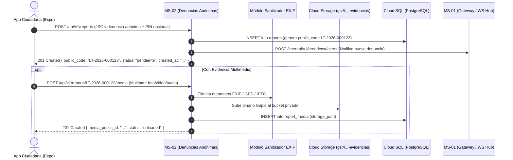

# Plan de Implementación: MS-02 Denuncias Anónimas (Versión Final)

**Microservicio:** `ms-02-denuncias-anonimas`  
**Ubicación en repo:** `backEnd/services/ms-02-denuncias-anonimas/`  
**Framework:** FastAPI (Python 3.12) + SQLAlchemy 2.0 Async + Pydantic V2  
**Despliegue objetivo:** Google Cloud Run (Serverless Container)  
**Storage Dedicado:** `gs://comisaria-evidencias-delitos/` (Bucket Privado con URLs Firmadas)

---

## 1. Responsabilidades del Microservicio

1. **Ingesta Anónima de Delitos:** Recepción de denuncias de delitos (Robo, Extorsión, Violencia Familiar, Sospechosos, Drogas, etc.) garantizando anonimato estricto (cero PII, sin persistencia de IP ni huellas de hardware).
2. **Generación Atómica de Códigos Públicos:** Asignación secuencial e inmutable de identificadores `LT-YYYY-000001` mediante la secuencia PostgreSQL `seq_reports_public_code`.
3. **Gestión Criptográfica de Seguimiento:** Almacenamiento seguro mediante **HMAC-SHA256 con clave secreta del servidor** del código secreto ciudadano (`followup_code_hash`).
4. **Sanitización Inmediata de Multimedia:** Recepción vía Multipart/Form-Data, despojo completo de metadatos EXIF / geolocalización embebida en memoria/disco temporal con Pillow/piexif y subida al bucket privado.
5. **Protección de Identificadores Internos:** El ciudadano solo interactúa con el `public_code`. Nunca se expone el UUID interno de la base de datos en respuestas públicas ni en la ruta de subida de evidencias.
6. **Gestión de URLs Firmadas (V4 Signed URLs):** Generación de enlaces temporales de lectura (expiración máxima 15 min) para la visualización de evidencias por oficiales autenticados.
7. **Emisión de Alertas en Tiempo Real:** Envío de payload HTTP a MS-01 (`POST /internal/v1/broadcast/alerts`) usando el cliente compartido `packages/shared/clients/broadcast_client.py`.
8. **Consulta Pública de Estado y Auditoría Policial:** Endpoint de consulta de estatus para ciudadanos y endpoints de gestión de estados (`report_status_history`) y notas internas para oficiales.

---

## 2. Diagrama de Flujo del Microservicio



---

## 3. Estructura de Directorios en `backEnd/`

```text
backEnd/services/ms-02-denuncias-anonimas/
├── app/
│   ├── __init__.py
│   ├── main.py                     # Instancia FastAPI, CORS y ciclo de vida
│   ├── core/
│   │   ├── __init__.py
│   │   ├── config.py               # Settings (Bucket Name, MS-01 URL, DB URI, HMAC Key)
│   │   └── dependencies.py         # Inyección DB, validación de JWT policial
│   ├── schemas/
│   │   ├── __init__.py
│   │   ├── report.py               # CreateReportDTO, PublicReportResponseDTO, StatusQueryDTO
│   │   ├── media.py                # MediaUploadResponseDTO, SignedUrlResponseDTO
│   │   └── category.py             # CategoryResponseDTO
│   ├── services/
│   │   ├── __init__.py
│   │   ├── report_service.py       # Creación de denuncia, HMAC de PIN y consulta de estado
│   │   ├── media_sanitizer.py      # Eliminación de EXIF con Pillow/piexif y validación MIME
│   │   └── storage_client.py       # Cliente GCS / MinIO + V4 Signed URLs
│   ├── api/
│   │   ├── __init__.py
│   │   └── v1/
│   │       ├── __init__.py
│   │       ├── router.py           # Agregador de rutas
│   │       ├── public_reports.py   # POST /reports, POST /reports/{code}/media, GET /{code}/status
│   │       ├── categories.py       # GET /categories (tipo: denuncia_anonima)
│   │       └── police_reports.py   # GET /police/reports, PATCH /police/reports/{id}/status
│   └── middlewares/
│       ├── __init__.py
│       └── privacy_headers.py      # Supresión de headers de IP y tracking en logs
├── tests/
│   ├── conftest.py
│   ├── test_reports_creation.py
│   ├── test_exif_sanitizer.py
│   └── test_status_tracking.py
├── Dockerfile                      # Multi-stage container para Cloud Run
├── requirements.txt
└── README.md
```

> [!IMPORTANT]
> **Modelos ORM Centralizados:** MS-02 no declara modelos SQLAlchemy propios; importa directamente las entidades `Report`, `ReportMedia`, `ReportCategory` y `ReportStatusHistory` desde `packages/shared/models/`.

---

## 4. Endpoints de la API

### Ciudadano (Público / Anónimo)
- `POST /api/v1/reports`: Crea denuncia anónima. Retorna `{ public_code, status, created_at }` (cero UUIDs internos).
- `POST /api/v1/reports/{public_code}/media`: Recibe archivo por multipart, sanitiza EXIF y almacena.
- `GET /api/v1/reports/{public_code}/status`: Consulta pública de estado. Admite query opcional `?followup_code=...` validado contra `followup_code_hash` vía HMAC-SHA256.
- `GET /api/v1/categories`: Lista categorías activas filtradas por `applicable_type = 'denuncia_anonima'`.

### Policial (Autenticado vía JWT / MS-01)
- `GET /api/v1/police/reports`: Bandeja de denuncias con filtros (estado, prioridad, rango de fechas).
- `GET /api/v1/police/reports/{id}`: Detalle de denuncia + URLs firmadas temporales para evidencias.
- `PATCH /api/v1/police/reports/{id}/status`: Actualiza estado y crea registro en historial.
- `POST /api/v1/police/reports/{id}/notes`: Agrega nota interna policial.

---

## 5. Pipeline de Sanitización EXIF y Almacenamiento

### 5.1 Tratamiento de Imágenes (`Pillow` / `piexif`)
1. Carga del flujo de bytes en memoria (`io.BytesIO`).
2. Detección y eliminación de etiquetas EXIF (GPSInfo, DateTimeOriginal, Make, Model, Software).
3. Re-codificación en JPEG/PNG limpio y compresión con calidad 85%.
4. Generación de miniatura de 300x300 px para vista previa en el panel policial.

### 5.2 Almacenamiento Seguro
- **Desarrollo:** MinIO S3 bucket `comisaria-evidencias-delitos`.
- **Producción:** Google Cloud Storage con `Uniform bucket-level access` y V4 Signed URLs (15 min).

---

## 6. Fases de Desarrollo Paso a Paso

1. **Paso 1: Integración con `packages/shared`:** Importar modelos `Report`, `ReportMedia` y el cliente compartido `broadcast_client.py`.
2. **Paso 2: Generador de Códigos Públicos:** Utilizar la secuencia de PostgreSQL `seq_reports_public_code` (`LT-YYYY-XXXXXX`).
3. **Paso 3: Sanitizador de Multimedia:** Implementar `media_sanitizer.py` con test de eliminación completa de GPS y metadatos.
4. **Paso 4: Endpoints Públicos:** Implementar `POST /reports`, `POST /reports/{code}/media` y `GET /{code}/status` con HMAC-SHA256.
5. **Paso 5: Endpoints Policiales:** Implementar listados protegidos por JWT y generación de V4 Signed URLs.
6. **Paso 6: Tests Automatizados:** Cobertura de tests unitarios y validación en Docker local.

---

## 7. Criterios de Aceptación y Verificación

1. [x] **Cero PII / Cero UUIDs Expuestos:** El denunciante solo recibe y maneja su `public_code`.
2. [x] **Sanitización Verificada:** 100% de las imágenes subidas pierden metadatos EXIF y coordenadas GPS antes de persistirse.
3. [x] **Hash Seguro de PIN:** Los códigos de seguimiento se validan mediante HMAC-SHA256 con salt/server key.
4. [x] **Alertas en Tiempo Real:** Toda denuncia ingresada dispara la notificación hacia MS-01 vía `broadcast_client.py`.
