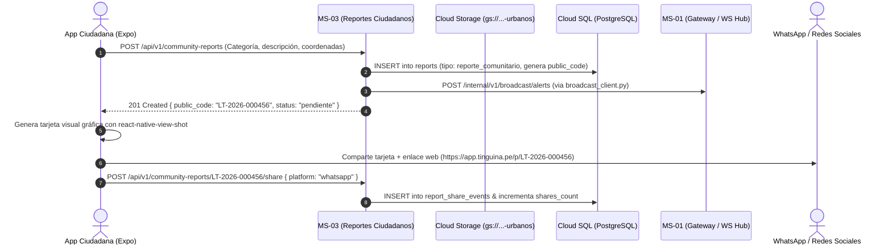

# Plan de Implementación: MS-03 Reportes Ciudadanos y Comunitarios (Versión Final)

**Microservicio:** `ms-03-reportes-ciudadanos`  
**Ubicación en repo:** `backEnd/services/ms-03-reportes-ciudadanos/`  
**Framework:** FastAPI (Python 3.12) + SQLAlchemy 2.0 Async + Pydantic V2  
**Despliegue objetivo:** Google Cloud Run (Serverless Container)  
**Storage Dedicado:** `gs://comisaria-reportes-urbanos/` (Bucket Cívico Restringido + URLs Firmadas / CDN)

---

## 1. Responsabilidades del Microservicio

1. **Gestión de Incidencias Urbanas:** Ingesta de reportes cívicos no criminales (baches, alumbrado público dañado, basura acumulada, postes caídos, desagües colapsados, espacios inseguros).
2. **Sanitización de Evidencias Cívicas:** Recepción de fotografías del incidente, eliminación obligatoria de metadatos EXIF / GPS del denunciante y almacenamiento en el bucket `gs://comisaria-reportes-urbanos/`.
3. **Soporte para Difusión en Redes Sociales:**
   - La tarjeta gráfica es renderizada en el cliente móvil (`react-native-view-shot`) para inmediatez y cero consumo de GPU en backend.
   - MS-03 provee un endpoint web con OpenGraph Meta Tags (`GET /community/p/{public_code}`) para que los enlaces compartidos en WhatsApp, Facebook y Telegram muestren vista previa rica.
4. **Métricas de Impacto Comunitario:** Endpoint `POST /api/v1/community-reports/{public_code}/share` que incrementa `shares_count` y registra eventos anónimos en `report_share_events`.
5. **Notificación en Tiempo Real:** Emisión de alerta cívica hacia MS-01 vía `packages/shared/clients/broadcast_client.py` para actualizar la bandeja de operadores policiales y del Serenazgo distrital.
6. **Gestión Operativa de Derivaciones:** Soporte para cambiar estados a `derivado` (a Serenazgo o Municipio) o `resuelto` con constancia pública visible para los vecinos.

---

## 2. Diagrama de Flujo del Microservicio



---

## 3. Estructura de Directorios en `backEnd/`

```text
backEnd/services/ms-03-reportes-ciudadanos/
├── app/
│   ├── __init__.py
│   ├── main.py                     # Instancia FastAPI y ciclo de vida
│   ├── core/
│   │   ├── __init__.py
│   │   ├── config.py               # Settings (Bucket Name, MS-01 URL, DB URI)
│   │   └── dependencies.py         # Inyección DB y autenticación policial
│   ├── schemas/
│   │   ├── __init__.py
│   │   ├── community_report.py     # CreateCommunityReportDTO, PublicCommunityReportResponseDTO
│   │   ├── share.py                # ShareEventDTO, ShareCountResponseDTO
│   │   └── web_preview.py          # OpenGraphMetaDTO
│   ├── services/
│   │   ├── __init__.py
│   │   ├── community_service.py    # Lógica de creación, listado público y derivación
│   │   ├── civic_sanitizer.py      # Limpieza EXIF de fotos cívicas
│   │   └── civic_storage.py        # Cliente GCS / MinIO para bucket de reportes urbanos
│   ├── api/
│   │   ├── __init__.py
│   │   └── v1/
│   │       ├── __init__.py
│   │       ├── router.py           # Agregador de rutas
│   │       ├── public_reports.py   # POST /community-reports, POST /{code}/media, GET /{code}
│   │       ├── shares.py           # POST /community-reports/{code}/share
│   │       ├── categories.py       # GET /categories (tipo: reporte_comunitario)
│   │       └── police_reports.py   # GET /police/community-reports, PATCH /police/{id}/status
│   ├── templates/                  # Plantilla Jinja2 liviana para Meta Tags OpenGraph
│   │   └── og_preview.html
│   └── middlewares/
│       ├── __init__.py
│       └── privacy_headers.py
├── tests/
│   ├── conftest.py
│   ├── test_community_reports.py
│   └── test_share_events.py
├── Dockerfile                      # Multi-stage container para Cloud Run
├── requirements.txt
└── README.md
```

> [!IMPORTANT]
> **Modelos ORM Centralizados:** MS-03 importa directamente `Report`, `ReportMedia`, `ReportShareEvent` y `ReportCategory` desde `packages/shared/models/`.

---

## 4. Endpoints de la API

### Ciudadano (Público / Anónimo)
- `POST /api/v1/community-reports`: Registra un problema urbano. Retorna `{ public_code, status, created_at }`.
- `POST /api/v1/community-reports/{public_code}/media`: Sube fotografía sanitizada de la falla urbana.
- `GET /api/v1/community-reports`: Listado público de incidentes comunitarios recientes en el mapa distrital.
- `GET /api/v1/community-reports/{public_code}`: Detalle público del reporte cívico y su estado de atención.
- `POST /api/v1/community-reports/{public_code}/share`: Registra métrica de difusión `{ "platform": "whatsapp" | "facebook" | "other" }`.
- `GET /community/p/{public_code}`: Página web renderizada con Jinja2 con Meta Tags OpenGraph (`og:image`, `og:title`) para vistas previas en redes.

### Policial / Municipal (Autenticado)
- `GET /api/v1/police/community-reports`: Bandeja de reportes urbanos con filtros de zona, categoría y estado.
- `PATCH /api/v1/police/community-reports/{id}/status`: Actualiza estado (`en_atencion`, `derivado` a Serenazgo/Municipio, `resuelto`) con nota pública de constancia.

---

## 5. Fases de Desarrollo Paso a Paso

1. **Paso 1: Schemas y Dependencias:** Integrar con `packages/shared/models/` y `broadcast_client.py`.
2. **Paso 2: Subida y Sanitización de Fotos Urbanas:** Implementar `civic_sanitizer.py` y subida a `gs://comisaria-reportes-urbanos/`.
3. **Paso 3: Endpoint de Compartir y OpenGraph Preview:** Implementar `POST /share` y template `og_preview.html`.
4. **Paso 4: Notificación a MS-01:** Conectar webhook hacia MS-01 para broadcast en tiempo real.
5. **Paso 5: Tests y Verificación en Docker Local:** Validar aislamiento de fallos respecto a MS-02.

---

## 6. Criterios de Aceptación y Verificación

1. [x] **Aislamiento Total:** El flujo de reportes comunitarios opera de forma 100% independiente a denuncias criminales.
2. [x] **Sanitización Obligatoria:** Fotos de problemas vecinales pierden metadatos EXIF antes de guardarse en el bucket.
3. [x] **Previsualización en Redes:** Enlaces `https://.../p/LT-2026-XXXXXX` generan tarjetas con imagen y título en WhatsApp.
4. [x] **Trazabilidad de Derivaciones:** Todo reporte derivado a Serenazgo/Municipio queda registrado con motivo y fecha.
