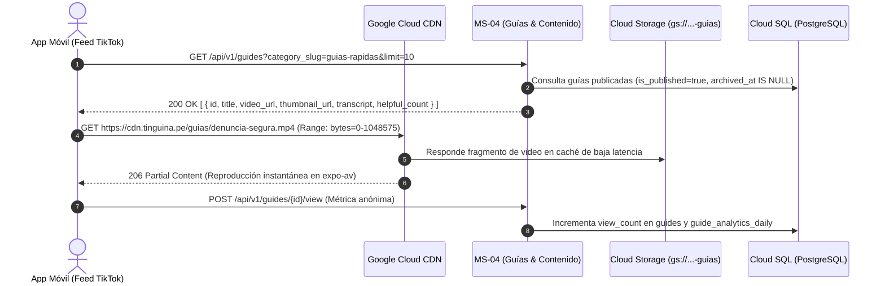

# Plan de Implementación: MS-04 Guías y Contenido (Biblioteca TikTok) - Versión Final

**Microservicio:** `ms-04-guias-contenido`  
**Ubicación en repo:** `backEnd/services/ms-04-guias-contenido/`  
**Framework:** FastAPI (Python 3.12) + SQLAlchemy 2.0 Async + Pydantic V2  
**Despliegue objetivo:** Google Cloud Run (Serverless Container)  
**Storage Dedicado:** `gs://comisaria-guias-videos/` + Google Cloud CDN

---

## 1. Responsabilidades del Microservicio

1. **Catálogo de Prevención y Educación Ciudadana:** Servir el feed vertical continuo de microvideos y artículos orientados a la seguridad ciudadana y trámites.
2. **Distribución Audiovisual vía Google Cloud CDN:** Entrega de videos MP4 (H.264/AAC) y miniaturas optimizadas alojadas en `gs://comisaria-guias-videos/` con soporte nativo para peticiones de rango HTTP (HTTP Range Requests / Byte-Ranges) para reproducción instantánea y bajo buffer en la app móvil Expo.
3. **Analítica Anónima Agregada:**
   - Registro de reproducciones: `POST /api/v1/guides/{id}/view` (incrementa `view_count` y tabla diaria `guide_analytics_daily`).
   - Registro de utilidad ciudadana: `POST /api/v1/guides/{id}/helpful` (incrementa `helpful_count`).
4. **Gestión Administrativa de Contenidos (Panel Policial):**
   - Endpoints autenticados para que la comisaría cargue nuevos videos de orientación, transcriba pasos, defina destacados (`is_featured`) y publique o archive guías.
5. **Preservación de Historial Analítico (Soft-Delete):**
   - El descarte de guías utiliza despublicación y archivo (`is_published = false`, `archived_at = now()`), evitando borrar registros en cascada para no perder estadísticas históricas de prevención.
6. **Aislamiento de Carga:** El consumo masivo de videos por parte de la población no impacta ni comparte recursos de base de datos ni storage con las denuncias críticas de MS-02.

---

## 2. Diagrama de Flujo del Microservicio



---

## 3. Estructura de Directorios en `backEnd/`

```text
backEnd/services/ms-04-guias-contenido/
├── app/
│   ├── __init__.py
│   ├── main.py                     # Instancia FastAPI y ciclo de vida
│   ├── core/
│   │   ├── __init__.py
│   │   ├── config.py               # Settings (Bucket Guías, CDN Base URL, DB URI)
│   │   └── dependencies.py         # Inyección DB y autenticación policial para gestión
│   ├── schemas/
│   │   ├── __init__.py
│   │   ├── guide.py                # GuideFeedResponseDTO, GuideDetailDTO, GuideCreateDTO
│   │   ├── category.py             # GuideCategoryResponseDTO
│   │   └── analytics.py            # AnalyticsSummaryDTO
│   ├── services/
│   │   ├── __init__.py
│   │   ├── guide_service.py        # Consultas de feed, filtrado y paginación
│   │   ├── content_storage.py      # Subida de videos y thumbnails a GCS con metadata CDN
│   │   └── analytics_service.py    # Incremento atómico de métricas diarias
│   ├── api/
│   │   ├── __init__.py
│   │   └── v1/
│   │       ├── __init__.py
│   │       ├── router.py           # Agregador de rutas
│   │       ├── public_guides.py    # GET /guides, GET /guides/{slug}, POST /{id}/view, POST /{id}/helpful
│   │       ├── categories.py       # GET /guide-categories
│   │       └── admin_guides.py     # POST /admin/guides, PUT /admin/guides/{id}, PATCH /admin/guides/{id}/archive
│   └── middlewares/
│       ├── __init__.py
│       └── cache_headers.py        # Cabeceras Cache-Control públicas para optimizar CDN
├── tests/
│   ├── conftest.py
│   ├── test_guides_feed.py
│   └── test_analytics_counter.py
├── Dockerfile                      # Multi-stage container para Cloud Run
├── requirements.txt
└── README.md
```

> [!IMPORTANT]
> **Modelos ORM Centralizados:** MS-04 importa `Guide`, `GuideCategory`, `GuideResource` y `GuideAnalyticsDaily` desde `packages/shared/models/`.

---

## 4. Endpoints de la API

### Ciudadano (Público / Optimizado para CDN)
- `GET /api/v1/guides`: Listado paginado de guías publicadas para el feed vertical.
  - Query params: `?category_slug=extorsion-llamadas&limit=10&cursor=...`
- `GET /api/v1/guides/{slug}`: Detalle completo de una guía, transcripción y recursos adicionales.
- `GET /api/v1/guide-categories`: Lista de categorías activas para los tabs superiores de la app móvil.
- `POST /api/v1/guides/{id}/view`: Registra reproducción y suma métrica diaria anónima.
- `POST /api/v1/guides/{id}/helpful`: Incrementa el contador de "Me ayudó".

### Panel Policial / Administrativo (Autenticado)
- `POST /api/v1/admin/guides`: Crea una nueva guía con video adjunto y transcripción.
- `PUT /api/v1/admin/guides/{id}`: Edita título, texto, orden (`sort_order`) o estado (`is_published`, `is_featured`).
- `PATCH /api/v1/admin/guides/{id}/archive`: Archiva la guía mediante soft-delete (`is_published = false`, `archived_at = now()`), conservando sus métricas en `guide_analytics_daily`.
- `GET /api/v1/admin/guides/analytics/summary`: Reporte de guías más vistas y de mayor impacto preventivo.

---

## 5. Fases de Desarrollo Paso a Paso

1. **Paso 1: Schemas y Modelos:** Integrar modelos ORM desde `packages/shared/models/`.
2. **Paso 2: Subida y Almacenamiento en GCS / MinIO:** Configuración de `content_storage.py` con políticas de lectura pública y cabeceras `Cache-Control: public, max-age=86400` para Cloud CDN.
3. **Paso 3: Endpoints Públicos de Feed:** Implementar listado optimizado de feed vertical con cursor pagination.
4. **Paso 4: Módulo de Analítica Agregada:** Implementar incremento atómico de vistas y `helpful_count` en PostgreSQL.
5. **Paso 5: CRUD Administrativo Policial:** Vistas de gestión con soft-delete.
6. **Paso 6: Tests y Verificación en Docker Local:** Pruebas unitarias y empaquetado para Google Cloud Run.

---

## 6. Criterios de Aceptación y Verificación

1. [x] **Reproducción Fluida:** Entrega de fragmentos de video en < 300ms mediante Cloud CDN / MinIO Range requests.
2. [x] **Preservación de Métricas:** Archivar una guía nunca destruye sus registros de analítica histórica.
3. [x] **Aislamiento Total:** El streaming de guías no satura la base de datos de denuncias policiales.
